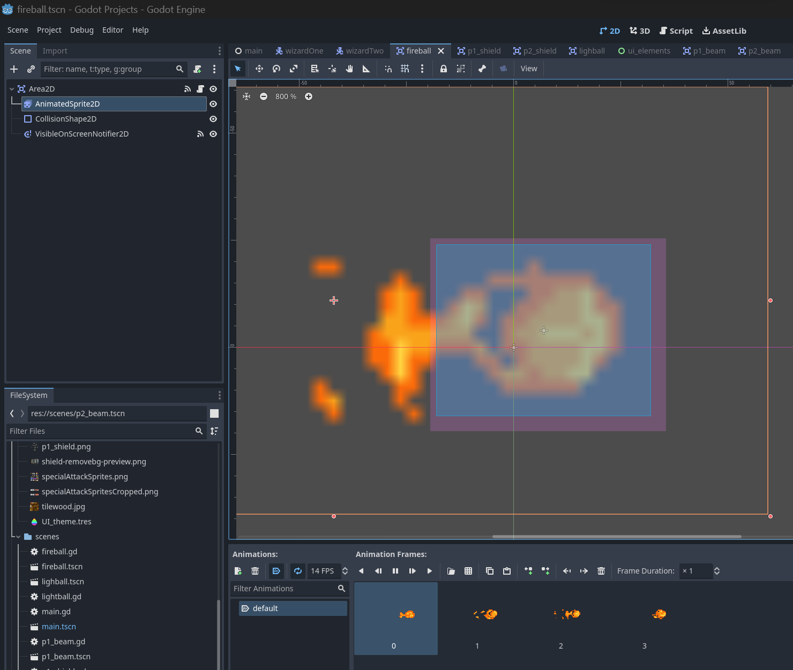
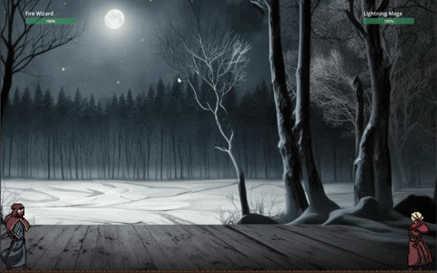
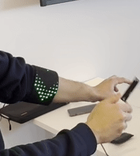

# Final Project: Strange Battle

## Project Overview
Strange battle is a 2D 1v1 game where players cast battle each other through spells to win. Each player has 4 different spells that they can cast. The spells are pulse, beam, defend and special attack. 
The spell selection interface was inpired from 'Dr. Strange', and we implemented the same through computer vision using OpenCV and mediapipe. The game is Godot, an open source game engine.

The hardware closely follows everything that the gameUI requires. The hardware for each player consists of a wand with a gyroscope and accelerometer and bracelet with a neopixel matrix that indicates the selected spell. The wand is used to cast the selected spell and colors change according to the spell that is selected. This can be better illustrated through a video.

## Table of Contents
- [Installation](#installation)
- [Design Implementation](#design-implementation)
- [Design Process](#design-process)
- [Contributors](#contributors)
- [License](#license)

## Installation
To replicate the project, you will need:
- 3 laptops
- 2 wands (build instructions in the implementation section)
- 2 bracelets (build instructions in the implementation section)
- Raspberry Pi (Only if you want to have your own MQTT broker)

## Design Implementation

### Spell Selection Interface and computer vision
### Design - Gesture Based Magic Circle

The idea of magic circle begins with the need to identify which spell the player want to cast. Since we have difficulty analyzing IMU based gesture on the wand end, we decided to add the magic circle as a way for the user to interact with the spell and also visualize their player status at the same time. 

### The final Design of Magic Circle

### The Game UI

The game was developed using Godot, an Open Source Game Engine. All the the game assets were downloaded from [deviant-art](https://www.deviantart.com/). 

The way godot works is that each interactable element is a 'scene'. Our game has the following scenes:
1. Main : The main node that conatins all other scenes
2. Fire Wizard : Player1, the character on the left hand side.
3. Lightning Mage: Player2, the character on the right hand side.
4. UI : The UI that health bars for both players
5. Player_1_spells: Shield, Pulse, Beam, Special Attack for Player1
6. Player_2_spells: Shield, Pulse, Beam, Special Attack for Player2

Below are a few snippets of the different spells we prototyped in Godot.
1. Beam Attack

2. Pulse Attack

3. Shield

4. Defending an attack

### Hardware
# 1. Wand:

We made two wands for each player to user. The wand hardware consists of the following:
- ESP32 Dev Module
- MPU6050 IMU (Accelerometer + Gyroscope)
- Neopixel LED Stick
- Vibration Motor

The wand will trigger when the angular acceleration along z axis (measured by gyroscope) exceeds 4.0, it will send a MQTT message to the player class and trigger multiple reactions during the game play.

The wand will also subscribe to the incoming MQTT message and display relevant LED effects (also use vibration motor to provide haptic feedback)

# 2. Bracelet:

## Gauntlet Design

We have used:

1. 8x32 LED Matrix

to be worn like this:

2. Esp32-s2 (Feather Development Board) as our microcontroller because of its compact size.

3. Black Fabric 

<!-- And Finally (with some hot glue and paper clips), we had this:

 @Omar Insert image here -->

 The plan at first was to make two of these, but due to time and resources constraints we ended up with only one gauntlet to show the idea of what we are trying to achieve

## How it works and how we achieved that:

As mentioned above, we have five choices in the magic circle and the gauntlet is there to show the user and the opponent what spell they are currently selecting from the magic circle. The spell shown in the gauntlet changes with spell chosen form magic circle.

We used these three libraries to control the LED Matrix Adafruit_NeoMatrix, Adafruit_GFX and Adafruit_NeoPixel by configuring the code to match the specific LED Matrix we have. 

We started by configuring the matrix layout using the Zigzag flag in the library which is custom to our LED Matrix addresses as the way this one work is that each row or column reverses direction compared to the one before it. We also used Top and Left flags to indicate it starts from the top left pixel.

The client in the gauntlet code listens for player activation on mqtt and displays the number of the player connected as soon as they're activated.

As you can see form the code, the callback function in mqtt is always listening for mqtt messages and if it receives "IDD/player{player_ID}/currentfocus", it looks for the index with 1 in it and the rest will be zeros. The index with one refers to a spell in the magic circle, so we display that on the gauntlet. Every display has a function inside the code to display that spell. 

## Spells with their respective Gauntlet animation:

### 1. Pulse Magic

Pulse magic symbol was manually drawn on the LED Matrix and hardcoded using a function that we made that takes in all Xs and Ys of the pixels to light up and the color of all the pixels. This was done as bitmapping proved to be challenging when it came to something as unique as this project.

### 2. Shield

Shield was also hardocded to show the specific unique symbol for it.

### 3. Beam Magic

For Beam Magic, we used green lines from the center that span out to the outside to show a powerful continuous spell that.

### 4. Special Attack

The special attack is resembling Dr.Strange's time stone effect when it is activated which is why the gauntlet shows continuous arrows rotating around the hand

DR. Strange:

Our Implementation:

### 5. Health Display

The health is displayed by having all pixels lit at full health and decreasing with health lost. The color of pixels change from green when above 66/100 to yellow between 33 and 66 to red when below 33.

We also added a hit effect when a player gets hit where it displays a blinking red to imitate losing health. 

The function listens for hit message from mqtt where it has the health in it too that is used in displaying health from the 5 spells in the magic circle

# MQTT - Communication Protocol
In order to make the entire game system work and have multple device communicate effectively, we used MQTT as our primary wireless communication protocol. And in order to reduce delay, we self-hosted a MQTT broker on a raspberry pi connected to the eduroam network. 

We custom designed a list of MQTT topics and rules in order to support the distributed system. Here is a simplified pipeline when the player casts spells:

And here is the full list of MQTT topics:

## Design Process
Motivated by the idea of magic circle, the first thing that come to mind is to design a good interaction methods and make a magic circle not only aesthetically pleasing but also intuitive & usable. We started with this abstract idea of a rotational menu that can be controlled by the rotation of hand (tracked by a computer vision pipeline)

There will be five round "Spell Widgets" that revolves around some concentric orbit, whenever a widget is being rotated to the top, it will geacrfully animate and enlarge to show more detail. 

We call this status "in_focus"

The focused widget will expand to show more information such as widget name, and anount of spells remaining (you can understand it as "ammo"). 

We also thought about having glanceable information immediately available during the game play so the player won't need to rotate to a specific widget in order to focus and view details:

The widgets implementation can be found here: (other dependent UI calssed sudh cs icon and text also in the repo)\
[skillwidget.py](gestureWand/skillwidget.py) \
[statuswidget.py](gestureWand/statuswidget.py) 

## Gesture Tracking 
We used opencv and Mediapipe for hand tracking and enable full gesture control of the game interface. The gesture are designed to be intuitive and resembles the magic spell casting gestures (we referenced from Dr.Strange Movie). 

[Click here to view the Tracking class (./handtracking.py)](gestureWand/handtracking.py) 

At the beginning of the game, we designed an animation to guide the user of their starting gesture:

Once the starting gesture is being detected, the game will load some intermediate graphics (rough lines and circles) to respond to the user.
At the same time, player class is instantiated and will spawn another thread in the background to laod the final magic circle. This loading thread will take around 7 seconds on a M1 Max MacBook Pro.

In order to achieve reliability and efficiency, the angle of the hand tracking is achieved by finding the slope of the line segment formed between thumb and little finger. The process involves conversion to polar coordinates.

# Reflection

As we reflect on the journey of developing "Strange Battle," a 2D 1v1 game inspired by the mystical elements of 'Dr. Strange,' we must acknowledge the blend of creativity, technical skill, and collaborative effort that went into this project. As a team of three - Siddharth, Yifan, and Omar - we embarked on an adventure that combined computer vision, game development, and hardware interfacing, culminating in a unique gaming experience.

### Adapting to Challenges in the "Strange Battle" Project: A Shift from Machine Learning
In the initial stages of the "Strange Battle" project, our team had planned to incorporate machine learning for some of the game's core features. This ambitious approach seemed promising, aligning with our vision of creating a technologically advanced gaming experience. However, as we delved deeper into the development process, it became evident within the first two weeks that relying on machine learning posed significant challenges. The technology, while powerful, proved to be less reliable and more complex than anticipated for our project's specific needs. This realization was a critical turning point, prompting us to reassess and pivot our strategy.

### Strategic Planning and Rapid Execution in the Revised Project Phase
Faced with the limitations of machine learning, we quickly shifted our focus to more reliable and time-efficient methods. This strategic pivot required us to overhaul our planning, keeping in mind the shortened timeframe of two weeks. We revisited every aspect of the project - from design to implementation - to align with our new approach. This re-planning was not merely about scaling down our ambitions but rather reorienting them towards achievable, yet innovative solutions. Our team's adaptability was put to the test as we redefined roles, redistributed tasks, and set new milestones. Communication became more crucial than ever, with regular updates and discussions to ensure everyone was on the same page. Despite the time constraints, our team demonstrated remarkable efficiency in executing the revised plan. By focusing on achievable goals and leveraging our collective strengths, we were able to overcome the initial setback and steer the project towards a successful completion. This phase of the project highlighted the importance of flexibility in project management and the ability to make swift, informed decisions in the face of unforeseen challenges.

### Collaboration and Team Dynamics
Our team's diversity in skills and interests was our greatest asset. Siddharth’s enthusiasm for game mechanics, Yifan’s expertise in computer vision, and Omar’s knack for hardware integration played crucial roles. The synergy among us allowed for a harmonious blend of ideas and skills, fostering an environment where creative solutions could flourish.

### Challenges and Learning Experiences
The development process was not without its challenges. Integrating computer vision with the game engine required numerous iterations to ensure a seamless experience. Additionally, designing the hardware - the wands and bracelets - posed its own set of technical hurdles. These challenges, however, were valuable learning opportunities. We honed our problem-solving skills, learned to adapt quickly, and developed a deeper understanding of integrating various technologies.

### Innovation and Creativity
One of the project's highlights was the spell selection interface, inspired by 'Dr. Strange.' Implementing this through OpenCV and MediaPipe added a layer of complexity but also immense satisfaction upon its successful integration. The hardware components, especially the wand with its gyroscope and accelerometer, and the bracelet with the neopixel matrix, were not just functional but also added an aesthetic appeal to the game.

### Technical Accomplishments
Our decision to use Godot, an open-source game engine, for the game's development was pivotal. It allowed us to create a flexible and dynamic gaming environment. The MQTT communication protocol for device interaction was another significant achievement, ensuring smooth gameplay and real-time interactions.

### Personal Growth
This project was more than just a technical endeavor; it was a journey of personal and professional growth. We learned the importance of clear communication, the value of constructive feedback, and the need for patience and perseverance in the face of challenges.

### Future Perspectives
Reflecting on what we achieved, we see a foundation for future exploration. The integration of physical hardware with digital gaming opens up possibilities for more immersive gaming experiences. Our project could serve as a stepping stone for others interested in exploring the intersection of gaming, computer vision, and hardware.

### Conclusion
In conclusion, "Strange Battle" was a testament to our collective vision, technical abilities, and collaborative spirit. It was a journey filled with challenges, learning, and, most importantly, a shared passion for innovation. As we move forward, we carry with us the lessons learned and the satisfaction of having turned a concept into a reality.

## Contributors
- Siddharth Kothari (sk2793)
- Yifan Zhou (yz2889)
- Omar Mokhtar (om84)

## License
Published under MIT license. Go ahead and build your own version of it!

